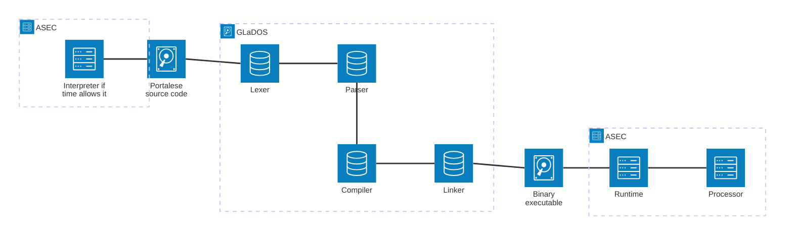

# Portalese

## Structure

*ASEC: Aperture Science Enrichment Center*

## Language

C-based language with a syntax similar to C and a few features from other languages.

## Features

- Integer and floating point numbers
- Strings
- Variables
- Functions
- Conditions
- Loops
- Custom data types (if time allows it)
- I/O (if time allows it)
- References (if time allows it)

## Standards

The following standards will be defined:

- Formal grammar in PEG
- Custom executable format
- Custom instruction set
